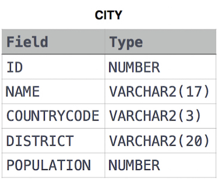

#   Basic Select Operations
The basic SELECT statement in SQL is used to retrieve data from a database. Here's a simple example of the SELECT statement:

```sql
SELECT column1, column2, ...
FROM table_name;
```

Explanation:

- `SELECT`: Keyword used to retrieve data from a database.
- `column1, column2, ...`: The columns you want to retrieve data from. You can specify specific column names or use `*` to select all columns.
- `FROM`: Keyword used to specify the table name from which you want to retrieve data.
- `table_name`: The name of the table where the data resides.

Example:

Let's consider a table named `employees` with columns `id`, `first_name`, `last_name`, and `email`. To select all columns from the `employees` table, the SQL query would look like this:

```sql
SELECT * FROM employees;
```

If you want to select only specific columns like `first_name` and `email`, the query would be:

```sql
SELECT first_name, email FROM employees;
```

Additionally, you can use some additional clauses with the SELECT statement:

- `WHERE`: Allows you to specify conditions to filter rows.
- `ORDER BY`: Sorts the result set based on specified columns.
- `GROUP BY`: Groups the result set by specified columns.
- `HAVING`: Applies a condition to the grouped rows.
- `LIMIT`: Limits the number of rows returned.

Here's an example using the `WHERE` clause:

```sql
SELECT * FROM employees WHERE department = 'Sales';
```

This query retrieves all columns from the `employees` table where the `department` column equals `'Sales'`.

These are the fundamental operations for selecting data in SQL.

##   Practice Questions

<details>
<summary><b>Revising the Select Query I</b></summary>

+ <details>
    <summary><b>Questions</b></summary>

   Query all columns for all American cities in the CITY table with populations larger than 100000. The CountryCode for America is USA.
    The CITY table is described as follows: 

   

   </details>
+ <details>
    <summary><b>Code</b></summary>
    
    ```sql
    SELECT * 
    FROM CITY 
    WHERE COUNTRYCODE = "USA" AND POPULATION > 100000
    ```
   </details>
</details>


<details>
<summary><b>Revising the Select Query II</b></summary>

+ <details>
    <summary><b>Questions</b></summary>

   Query the NAME field for all American cities in the CITY table with populations larger than 120000. The CountryCode for America is USA.
   The CITY table is described as follows:
   

   </details>
+ <details>
    <summary><b>Code</b></summary>
    
    ```sql
    SELECT * 
    FROM CITY 
    WHERE COUNTRYCODE="USA" AND POPULATION>1200000
    ```
   </details>
</details>


<details>
<summary><b>Select All</b></summary>

+ <details>
    <summary><b>Questions</b></summary>

   Query all columns (attributes) for every row in the CITY table. 
   The CITY table is described as follows:

   

   </details>
+ <details>
    <summary><b>Code</b></summary>
    
    ```sql
    SELECT * 
    FROM CITY
    ```
   </details>
</details>

<details>
<summary><b>Select By ID</b></summary>

+ <details>
    <summary><b>Questions</b></summary>

   Query all columns for a city in CITY with the ID 1661.
   The CITY table is described as follows:
   

   </details>
+ <details>
    <summary><b>Code</b></summary>
    
    ```sql
    SELECT * 
    FROM CITY 
    WHERE ID=1661
    ```
   </details>
</details>


<details>
<summary><b>Japanese Cities' Attributes</b></summary>

+ <details>
    <summary><b>Questions</b></summary>

   Query all attributes of every Japanese city in the CITY table. The COUNTRYCODE for Japan is JPN.
   The CITY table is described as follows:
   

   </details>
+ <details>
    <summary><b>Code</b></summary>
    
    ```sql
    SELECT * 
    FROM CITY 
    WHERE COUNTRYCODE = "JPN"
    ```
   </details>
</details>


<details>
<summary><b>Japanese Cities' Names</b></summary>

+ <details>
    <summary><b>Questions</b></summary>

   Query the names of all the Japanese cities in the CITY table. The COUNTRYCODE for Japan is JPN.
   The CITY table is described as follows:
   

   </details>
+ <details>
    <summary><b>Code</b></summary>
    
    ```sql
    SELECT NAME 
    FROM CITY 
    WHERE COUNTRYCODE = "JPN"
    ```
   </details>
</details>


<details>
<summary><b>Weather Observation Station 1</b></summary>

+ <details>
    <summary><b>Questions</b></summary>

   Query a list of CITY and STATE from the STATION table.The STATION table is described as follows:
   
   where LAT_N is the northern latitude and LONG_W is the western longitude.

   </details>
+ <details>
    <summary><b>Code</b></summary>
    
    ```sql
    SELECT CITY, STATE 
    FROM STATION
    ```
   </details>
</details>


<details>
<summary><b>Weather Observation Station 3</b></summary>

+ <details>
    <summary><b>Questions</b></summary>

   Query a list of CITY names from STATION for cities that have an even ID number. Print the results in any order, but exclude duplicates from the answer.
   The STATION table is described as follows:
   
   where LAT_N is the northern latitude and LONG_W is the western longitude.

   </details>
+ <details>
    <summary><b>Code</b></summary>
    
    ```sql
    SELECT DISTINCT(CITY)
    FROM STATION
    WHERE id % 2 = 0
    ```
   </details>
</details>


<details>
<summary><b>Weather Observation Station 4</b></summary>

+ <details>
    <summary><b>Questions</b></summary>

   Find the difference between the total number of CITY entries in the table and the number of distinct CITY entries in the table.
   The STATION table is described as follows:
   
   where LAT_N is the northern latitude and LONG_W is the western longitude.

   </details>
+ <details>
    <summary><b>Code</b></summary>
    
    ```sql
    SELECT (COUNT(CITY) - COUNT(DISTINCT(CITY))) 
    FROM STATION
    ```
   </details>
</details>


<details>
<summary><b>Weather Observation Station 5</b></summary>

+ <details>
    <summary><b>Questions</b></summary>

   Query the two cities in STATION with the shortest and longest CITY names, as well as their respective lengths (i.e.: number of characters in the name). If there is more than one smallest or largest city, choose the one that comes first when ordered alphabetically.
   The STATION table is described as follows:
   
   where LAT_N is the northern latitude and LONG_W is the western longitude.

   </details>
+ <details>
    <summary><b>Code</b></summary>
    
    ```sql
    (SELECT CITY, LENGTH(CITY) AS CITYLENGTH
    FROM STATION
    ORDER BY CITYLENGTH, CITY
    LIMIT 1)
    UNION
    (SELECT CITY, LENGTH(CITY) AS CITYLENGTH
    FROM STATION
    ORDER BY CITYLENGTH DESC, CITY
    LIMIT 1)
    ```
   </details>
</details>


<details>
<summary><b>Weather Observation Station 6</b></summary>

+ <details>
    <summary><b>Questions</b></summary>

   Query the list of CITY names starting with vowels (i.e., a, e, i, o, or u) from STATION. Your result cannot contain duplicates.
   
   Input Format
   The STATION table is described as follows
   
   where LAT_N is the northern latitude and LONG_W is the western longitude.

   </details>
+ <details>
    <summary><b>Code</b></summary>
    
    ```sql
    SELECT DISTINCT CITY 
    FROM STATION 
    WHERE CITY LIKE 'A%' OR CITY LIKE 'E%' OR CITY LIKE 'I%' OR CITY LIKE 'O%' OR CITY LIKE 'U%'
    ```

    or
    ```sql
    SELECT DISTINCT CITY 
    FROM STATION 
    WHERE LEFT(CITY, 1) IN ('a', 'e', 'i', 'o', 'u')
    ```

    or
    ```sql
    SELECT DISTINCT CITY 
    FROM STATION 
    WHERE CITY LIKE ('[a,e,i,o,u]%');
   ```
    or
    ```sql
    SELECT DISTINCT(CITY) FROM STATION
    WHERE UPPER(SUBSTRING(CITY,1,1)) IN ('A','E','I','O','U');
    ```
   </details>
</details>


<details>
<summary><b>Weather Observation Station 7</b></summary>

+ <details>
    <summary><b>Questions</b></summary>
    
    Query the list of CITY names ending with vowels (a, e, i, o, u) from STATION. Your result cannot contain duplicates.

    Input Format
    The STATION table is described as follows:
    
    where LAT_N is the northern latitude and LONG_W is the western longitude.

   </details>
+ <details>
    <summary><b>Code</b></summary>
    
    ```sql
    SELECT DISTINCT CITY FROM STATION 
    WHERE CITY LIKE '%A' OR CITY LIKE '%E' OR CITY LIKE '%I' OR CITY LIKE '%O' OR CITY LIKE '%U'
    ```
    or
    ```sql
    SELECT DISTINCT CITY 
    FROM STATION 
    WHERE RIGHT(CITY, 1) IN ('a', 'e', 'i', 'o', 'u')
    ```
    or
    ```sql
    SELECT  DISTINCT CITY 
    FROM STATION 
    WHERE CITY LIKE ('%[a,e,i,o,u]')
    ```
   </details>
</details>


<details>
<summary><b>Weather Observation Station 8</b></summary>

+ <details>
    <summary><b>Questions</b></summary>
    
    Query the list of CITY names from STATION which have vowels (i.e., a, e, i, o, and u) as both their first and last characters. Your result cannot contain duplicates.
    
    Input Format
    The STATION table is described as follows:
    
    where LAT_N is the northern latitude and LONG_W is the western longitude.

   </details>
+ <details>
    <summary><b>Code</b></summary>
    
    ```sql

    ```
   </details>
</details>
