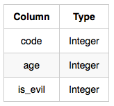

# Basic Join Operations in SQL

Join operations in SQL are used to combine rows from two or more tables based on related columns. They allow for retrieving related data from multiple tables in a single query. Basic join operations include INNER JOIN, LEFT JOIN, RIGHT JOIN, and FULL JOIN.

## INNER JOIN

The INNER JOIN returns rows when there is at least one match in both tables being joined. It only returns rows where the join condition is met.

### Syntax:
```sql
SELECT columns
FROM table1
INNER JOIN table2 ON table1.column = table2.column;
```

### Example:
Suppose we have two tables: `orders` and `customers`. The `orders` table contains order information, while the `customers` table contains customer details. To retrieve orders along with customer information for matched orders, we can use an INNER JOIN.

```sql
SELECT orders.order_id, customers.customer_name
FROM orders
INNER JOIN customers ON orders.customer_id = customers.customer_id;
```

## LEFT JOIN (or LEFT OUTER JOIN)

The LEFT JOIN returns all rows from the left table and the matched rows from the right table. If there is no match, NULL values are returned for the columns from the right table.

### Syntax:
```sql
SELECT columns
FROM table1
LEFT JOIN table2 ON table1.column = table2.column;
```

### Example:
Continuing with the previous example, if we want to retrieve all orders along with customer information, including orders with no matching customer, we can use a LEFT JOIN.

```sql
SELECT orders.order_id, customers.customer_name
FROM orders
LEFT JOIN customers ON orders.customer_id = customers.customer_id;
```

## RIGHT JOIN (or RIGHT OUTER JOIN)

The RIGHT JOIN returns all rows from the right table and the matched rows from the left table. If there is no match, NULL values are returned for the columns from the left table.

### Syntax:
```sql
SELECT columns
FROM table1
RIGHT JOIN table2 ON table1.column = table2.column;
```

### Example:
If we want to retrieve all customers along with their orders, including customers with no orders, we can use a RIGHT JOIN.

```sql
SELECT orders.order_id, customers.customer_name
FROM orders
RIGHT JOIN customers ON orders.customer_id = customers.customer_id;
```

## FULL JOIN (or FULL OUTER JOIN)

The FULL JOIN returns all rows when there is a match in one of the tables. It returns NULL values for columns from the table that does not have a match.

### Syntax:
```sql
SELECT columns
FROM table1
FULL JOIN table2 ON table1.column = table2.column;
```

### Example:
If we want to retrieve all orders along with customer information, including unmatched orders and customers, we can use a FULL JOIN.

```sql
SELECT orders.order_id, customers.customer_name
FROM orders
FULL JOIN customers ON orders.customer_id = customers.customer_id;
```

##   Practice Questions

<details>
<summary><b>African Cities</b></summary>

+ <details>
    <summary><b>Questions</b></summary>

   Given the **CITY** and **COUNTRY** tables, query the names of all cities where the **CONTINENT** is 'Africa'.

   **Note:** CITY.CountryCode and COUNTRY.Code are matching key columns.

   **Input Format**

   The **CITY** and **COUNTRY** tables are described as follows: 

   
   

   </details>
+ <details>
    <summary><b>Code</b></summary>
    
    ```sql
    SELECT CITY.NAME
    FROM CITY
    JOIN COUNTRY ON CITY.COUNTRYCODE = COUNTRY.CODE
    WHERE COUNTRY.CONTINENT = 'Africa';

    ```
   </details>
</details>


<details>
<summary><b>Average Population of Each Continent</b></summary>

+ <details>
    <summary><b>Questions</b></summary>

   Given the **CITY** and **COUNTRY** tables, query the names of all the continents (COUNTRY.Continent) and their respective average city populations (CITY.Population) rounded down to the nearest integer.

   **Note:** CITY.CountryCode and COUNTRY.Code are matching key columns.

   **Input Format**

   The **CITY** and **COUNTRY** tables are described as follows:

   
   


   </details>
+ <details>
    <summary><b>Code</b></summary>
    
    ```sql
    SELECT COUNTRY.CONTINENT, FLOOR(AVG(CITY.Population))
    FROM CITY
    JOIN COUNTRY ON CITY.COUNTRYCODE = COUNTRY.CODE
    GROUP BY COUNTRY.CONTINENT

    ```
   </details>
</details>


<details>
<summary><b>The Report</b></summary>

+ <details>
    <summary><b>Questions</b></summary>

   You are given two tables: Students and Grades. Students contains three columns ID, Name and Marks.

   

   Grades contains the following data:

   

   Ketty gives Eve a task to generate a report containing three columns: Name, Grade and Mark. Ketty doesn't want the NAMES of those students who received a grade lower than 8. The report must be in descending order by grade -- i.e. higher grades are entered first. If there is more than one student with the same grade (8-10) assigned to them, order those particular students by their name alphabetically. Finally, if the grade is lower than 8, use "NULL" as their name and list them by their grades in descending order. If there is more than one student with the same grade (1-7) assigned to them, order those particular students by their marks in ascending order.

    Write a query to help Eve.

   </details>
+ <details>
    <summary><b>Code</b></summary>
    
    ```sql
    SELECT 
    CASE 
        WHEN G.GRADE >=8 THEN S.NAME
        ELSE NULL
    END AS NAME, G.GRADE, S.MARKS
    FROM STUDENTS S
    JOIN GRADES G ON S.MARKS BETWEEN G.MIN_MARK AND G.MAX_MARK
    WHERE G.GRADE IS NOT NULL
    ORDER BY
        G.GRADE DESC,
        NAME ASC,
        S.MARKS ASC;

    ```
   </details>
</details>


<details>
<summary><b>Top Competitors</b></summary>

+ <details>
    <summary><b>Questions</b></summary>

   Julia just finished conducting a coding contest, and she needs your help assembling the leaderboard! Write a query to print the respective hacker_id and name of hackers who achieved full scores for more than one challenge. Order your output in descending order by the total number of challenges in which the hacker earned a full score. If more than one hacker received full scores in same number of challenges, then sort them by ascending hacker_id.

   ---
   **Input Format**
   The following tables contain contest data:

    + Hackers: The hacker_id is the id of the hacker, and name is the name of the hacker.
       

    + Difficulty: The difficult_level is the level of difficulty of the challenge, and score is the score of the challenge for the difficulty level. 
    

    + Challenges: The challenge_id is the id of the challenge, the hacker_id is the id of the hacker who created the challenge, and difficulty_level is the level of difficulty of the challenge.
    

    + Submissions: The submission_id is the id of the submission, hacker_id is the id of the hacker who made the submission, challenge_id is the id of the challenge that the submission belongs to, and score is the score of the submission. 
    


   </details>
+ <details>
    <summary><b>Code</b></summary>
    
    ```sql
    SELECT S.HACKER_ID, H.NAME FROM SUBMISSIONS S
    LEFT JOIN HACKERS H ON H.HACKER_ID = S.HACKER_ID
    LEFT JOIN CHALLENGES C ON C.CHALLENGE_ID = S.CHALLENGE_ID
    LEFT JOIN DIFFICULTY D ON D.DIFFICULTY_LEVEL = C.DIFFICULTY_LEVEL
    WHERE S.SCORE = D.SCORE
    GROUP BY S.HACKER_ID, H.NAME
    HAVING COUNT(S.HACKER_ID) > 1
    ORDER BY COUNT(S.HACKER_ID) DESC, S.HACKER_ID ASC

    ```
   </details>
</details>


<details>
<summary><b>Ollivander's Inventory</b></summary>

+ <details>
    <summary><b>Questions</b></summary>

   Harry Potter and his friends are at Ollivander's with Ron, finally replacing Charlie's old broken wand.

   Hermione decides the best way to choose is by determining the minimum number of gold galleons needed to buy each non-evil wand of high power and age. Write a query to print the id, age, coins_needed, and power of the wands that Ron's interested in, sorted in order of descending power. If more than one wand has same power, sort the result in order of descending age.

   ---
   **Input Format**

   Wands: The id is the id of the wand, code is the code of the wand, coins_needed is the total number of gold galleons needed to buy the wand, and power denotes the quality of the wand (the higher the power, the better the wand is).

    

   Wands_Property: The code is the code of the wand, age is the age of the wand, and is_evil denotes whether the wand is good for the dark arts. If the value of is_evil is 0, it means that the wand is not evil. The mapping between code and age is one-one, meaning that if there are two pairs, **_(code1,  age1)_** and **_(code2,  age2)_**, then **_code1 &ne; code2_**and **_age1 &ne; age2_**.

    


   </details>
+ <details>
    <summary><b>Code</b></summary>
    
    ```sql
    SELECT t2.id, t1.age, t2.coins_needed, t1.power
    FROM
    (SELECT MIN(coins_needed) AS min_coins, age, power, code
        FROM wands NATURAL JOIN wands_property
        WHERE is_evil = 0
        GROUP BY age, power, code
    ) t1 JOIN wands t2 ON t1.code = t2.code AND t1.min_coins = t2.coins_needed

    ORDER BY t1.power DESC, t1.age DESC;

    ```
   </details>
</details>


<details>
<summary><b>Challenges</b></summary>

+ <details>
    <summary><b>Questions</b></summary>

   Julia asked her students to create some coding challenges. Write a query to print the hacker_id, name, and the total number of challenges created by each student. Sort your results by the total number of challenges in descending order. If more than one student created the same number of challenges, then sort the result by hacker_id. If more than one student created the same number of challenges and the count is less than the maximum number of challenges created, then exclude those students from the result.

   **Input Format**

    The following tables contain challenge data:
    Hackers: The hacker_id is the id of the hacker, and name is the name of the hacker. 

   

   Challenges: The challenge_id is the id of the challenge, and hacker_id is the id of the student who created the challenge.

   

   </details>
+ <details>
    <summary><b>Code</b></summary>
    
    ```sql
    WITH CTE AS (
    SELECT 
        h.hacker_id AS hacker_id,
        name,
        COUNT(ch.challenge_id) AS challenges_count,
        COUNT(COUNT(ch.challenge_id)) OVER (PARTITION BY COUNT(ch.challenge_id)) AS same_results
    FROM hackers h
    JOIN challenges ch ON h.hacker_id = ch.hacker_id
    GROUP BY h.hacker_id, name
    )

    SELECT hacker_id, name, challenges_count
    FROM CTE    
    WHERE 
        challenges_count = (SELECT MAX(challenges_count) FROM CTE) OR same_results = 1
    ORDER BY 
        challenges_count DESC, hacker_id;

    ```
   </details>
</details>

<details>
<summary><b>Contest Leaderboard</b></summary>

+ <details>
    <summary><b>Questions</b></summary>

   You did such a great job helping Julia with her last coding contest challenge that she wants you to work on this one, too!

   The total score of a hacker is the sum of their maximum scores for all of the challenges. Write a query to print the hacker_id, name, and total score of the hackers ordered by the descending score. If more than one hacker achieved the same total score, then sort the result by ascending hacker_id. Exclude all hackers with a total score of 0 from your result.

   **Input Format** 
   The following tables contain contest data:

    + Hackers: The hacker_id is the id of the hacker, and name is the name of the hacker.
   

    + Submissions: The submission_id is the id of the submission, hacker_id is the id of the hacker who made the submission, challenge_id is the id of the challenge for which the submission belongs to, and score is the score of the submission. 
   


   </details>
+ <details>
    <summary><b>Code</b></summary>
    
    ```sql
    SELECT HACKER_ID, NAME, SUM(MAX_SCORE) AS TOT_SCORE
    FROM (
        SELECT HACKERS.HACKER_ID, HACKERS.NAME, SUBMISSIONS.CHALLENGE_ID, MAX(SUBMISSIONS.SCORE) AS MAX_SCORE
        FROM HACKERS
        LEFT JOIN SUBMISSIONS ON HACKERS.HACKER_ID = SUBMISSIONS.HACKER_ID
        WHERE SUBMISSIONS.SCORE > 0
        GROUP BY HACKERS.HACKER_ID, HACKERS.NAME, SUBMISSIONS.CHALLENGE_ID
        ) AS DETAILQUERY
    GROUP BY HACKER_ID, NAME
    ORDER BY TOT_SCORE DESC, HACKER_ID

    ```
   </details>
</details>


<details>
<summary><b>Population Census</b></summary>

+ <details>
    <summary><b>Questions</b></summary>

   Given the **CITY** and **COUNTRY** tables, query the sum of the populations of all cities where the **CONTINENT** is 'Asia'.

   **Note:** CITY.CountryCode and COUNTRY.Code are matching key columns.

   **Input Format**

   The **CITY** and **COUNTRY** tables are described as follows: 

   
   

   </details>
+ <details>
    <summary><b>Code</b></summary>
    
    ```sql
    SELECT SUM(CITY.POPULATION)
    FROM CITY
    JOIN COUNTRY ON CITY.COUNTRYCODE = COUNTRY.CODE
    WHERE COUNTRY.CONTINENT = 'ASIA';

    ```
   </details>
</details>